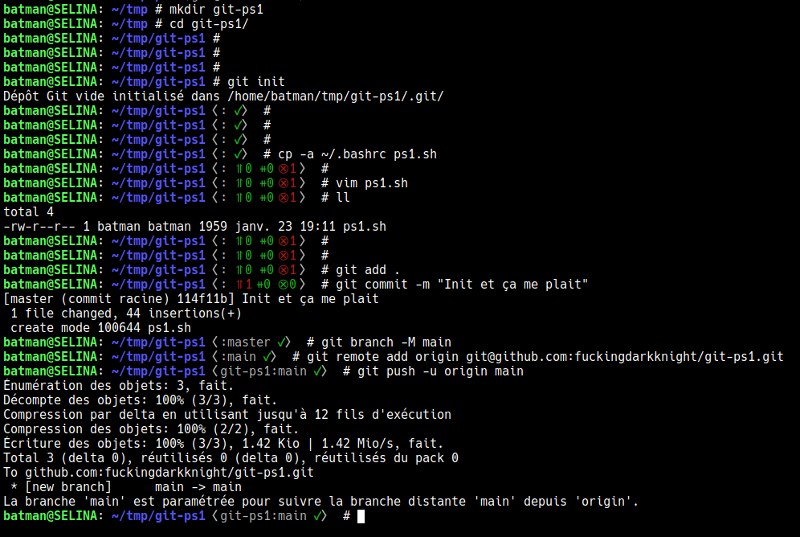

Petit script simple pour `bash` à intégrer dans son `.bashrc`, il permet d'intégrer une fonction dans l'env PS1 afin d'avoir des infos simples et directes quand on se trouve dans une arborescence `Git`.



Informations :
```shell
<remote:repository staged to commit | unstaged | new file >
```
